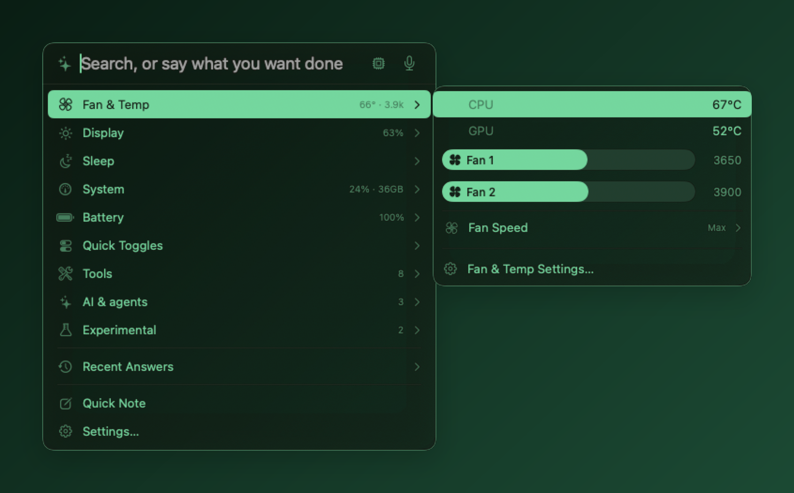
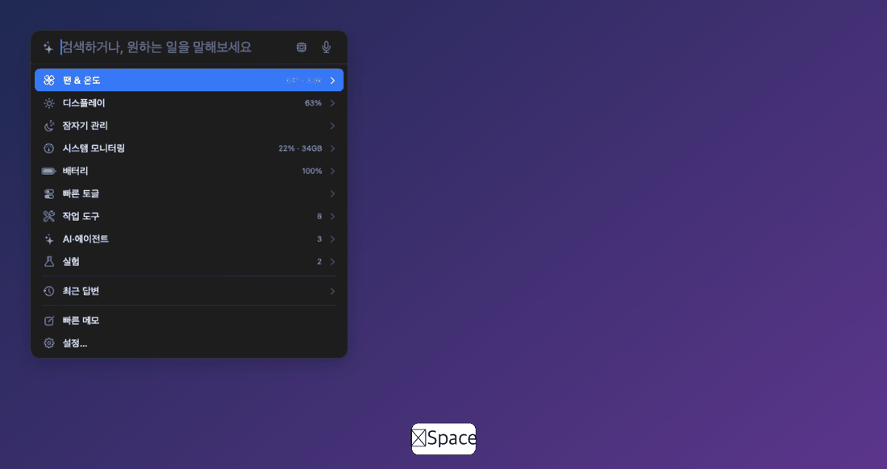

**English** · [한국어](README.md)

# Divee

**Everything you tweak on your Mac, in one menu bar app — one ⌥Space away.**

 

Divee is a free, lightweight menu bar utility for Apple Silicon Macs. It gathers fans & temperature, brightness, battery, sleep, window arranging, clipboard history and more into a single **cascading panel** — with a little cat living in your menu bar.

## Highlights

- **Cascading menu.** Press **⌥Space**, hover or press → on a row, and its details slide out to the side (up to three levels). Fully keyboard-driven: ↑↓ move · → open · ← back · Return run · ESC close. Sliders move with ←/→.
- **Search everything.** Type to search modules and commands, apps, files, Apple Notes, the dictionary, math (`12*34`) or the web — or just ask the AI.
- **Lightweight.** ~0.6% CPU when closed, ~1% with the panel open. Native macOS animations only; turn them off in Settings.
- **Private by default.** On-device first. Nothing leaves your Mac unless you enable Weather (open-meteo.com), Web search (Bing), AI Usage, or a remote AI backend — Settings › About lists what is on.

## Modules (turn on only what you need)

| Category | Modules |
|---|---|
| System | **Fan & Temp** (per-fan sliders, Max / Auto / temperature curve) · **Display** (built-in & external brightness via DDC, brightness keys for external displays) · **Battery** (health, cycles, power, adapter) · **Sleep** (keep awake with timer, Clamshell Mode) · **System** (CPU / memory / network / disk with sparklines) · **Quick Toggles** (Dark Mode, mute mic, hidden files, desktop icons, lock / screen off / screen saver, eject, empty Trash) |
| Tools | Clipboard history · Quick notes to Apple Notes (⌃⌥J) · Color picker (⌥⌘C) · Symbols · Window Arrange (gather app groups, split, focus) · Space names · Calendar & Reminders · Weather · Local search |
| AI & agents | Read screen & tap on-screen text · Web search · AI Usage (Claude Code / Codex limits) · Agent sessions (Claude Code / Codex inbox, ⌥⌘J) · Hooks (14 system events → commands, Shortcuts, apps, notifications, AI) |
| Experimental | Motion & Knock · Level · Hinge Fold · Camera look |

## AI assistant

Write what you want in plain language — "set brightness to 50", "max the fans", "gather my dev windows", "what's on my calendar today?" — and Divee runs the matching module actions. Backends: **Local-first** (default: Apple on-device → Ollama, escalates to your chosen server only when needed, marked ☁︎), **Apple on-device** (macOS 26+), **Ollama**, or any **OpenAI-compatible** server (key stored in Keychain). Hold **⌃⌥Space** to talk; speech is recognized on-device.

## Themes

Default (follows your system), Dracula, Nord and Retro Green — Settings › General › Theme.

## Install

Download [Divee-1.0.0.dmg](https://github.com/dorkman43/divee/releases/latest/download/Divee-1.0.0.dmg), drag Divee to Applications and launch it. Notarized by Apple. 
**Requires:** macOS 14 Sonoma or later on Apple Silicon (M1 or later). 
**Shortcuts:** ⌥Space panel · ⌃⌥Space hold to talk · ⌃⌥J quick note · ⌥⌘C pick a color · ⌥⌘O floating panel · ⌥⌘J jump to a waiting session · right-click the menu bar icon for Settings / Quit. 
**Uninstall:** if you used fan control or Clamshell Mode, click **Remove Helper** in Settings › Fan & Temp first, then quit Divee and move it to the Trash.

Feedback and bug reports are welcome in [Issues](https://github.com/dorkman43/divee/issues).

© 2026 dorkman43 · Divee is free to use.

