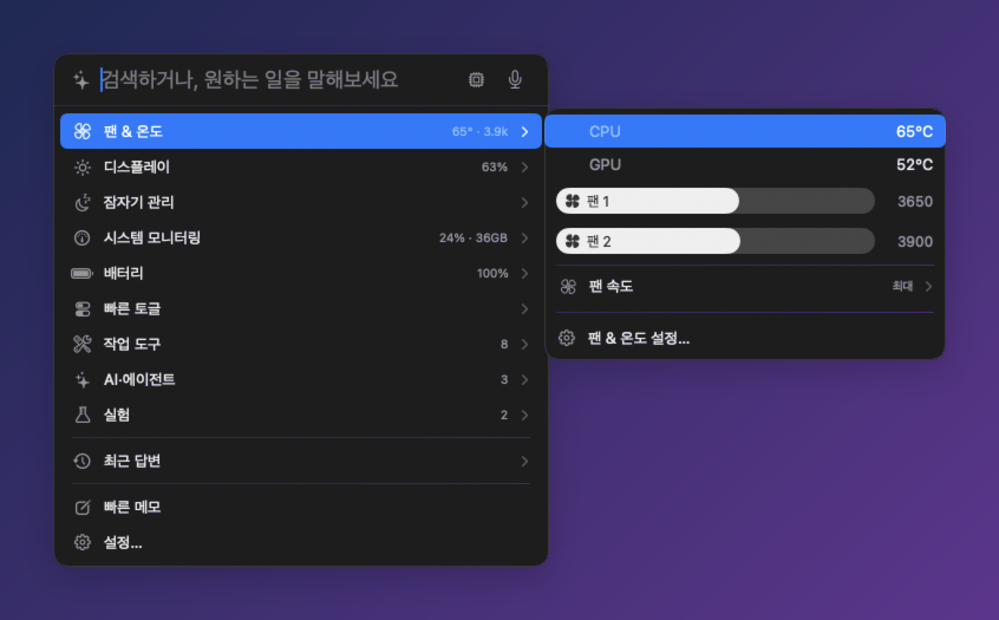
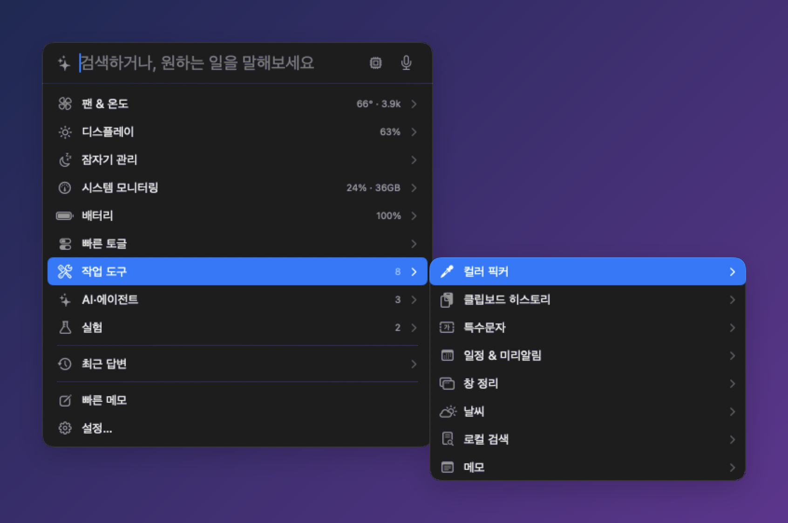
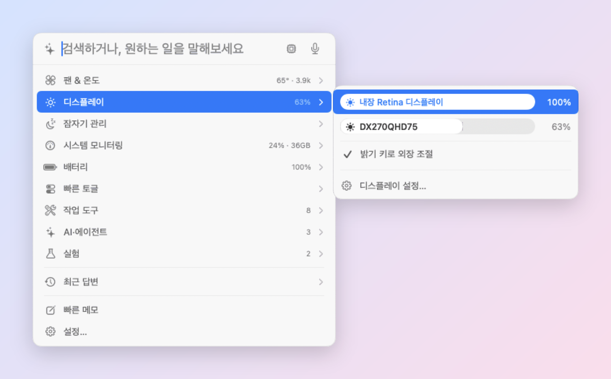
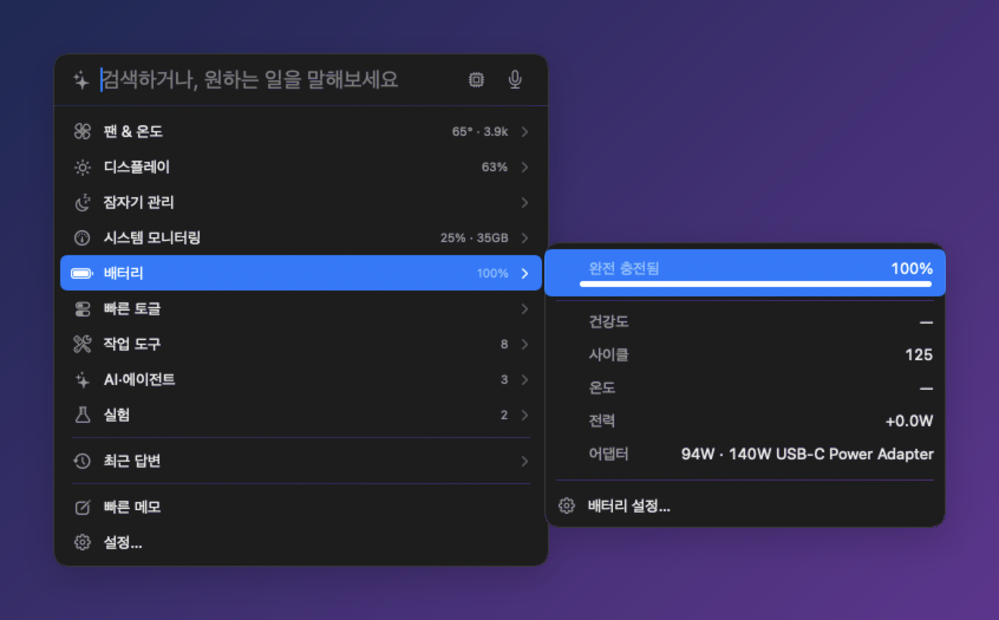
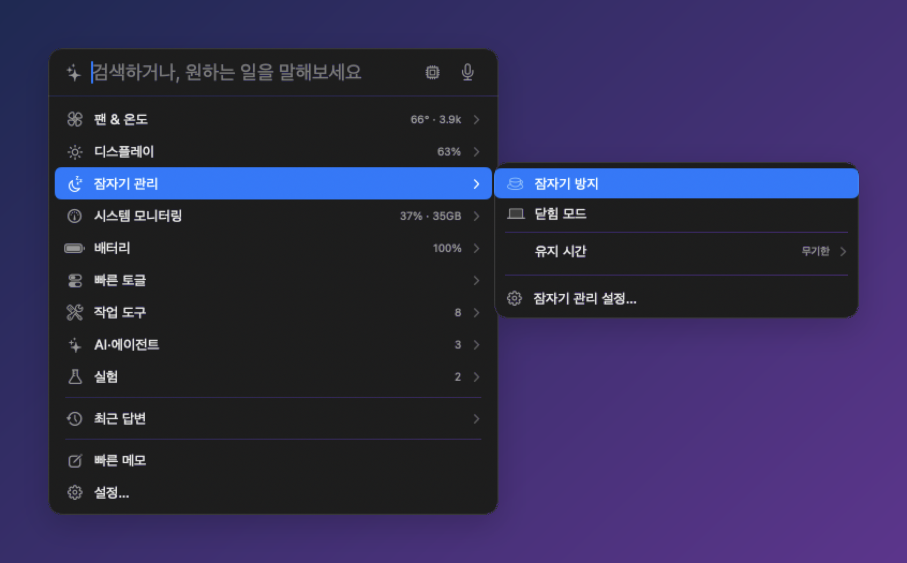
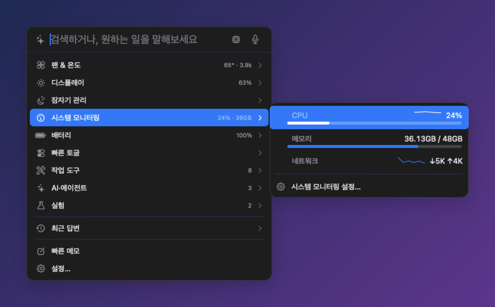
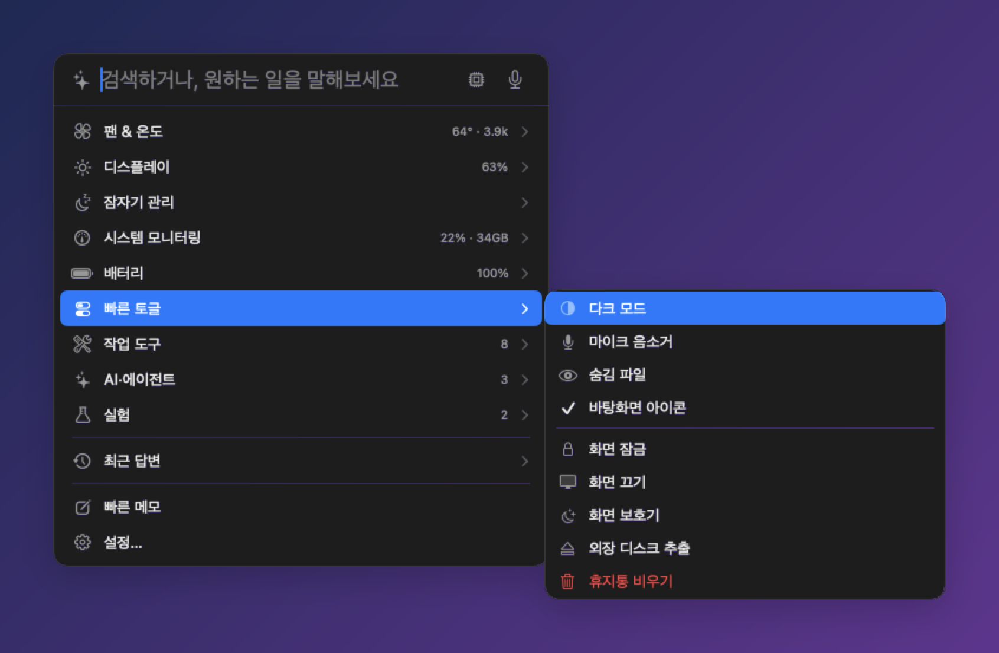
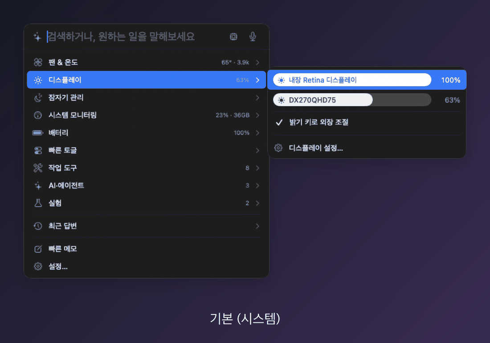
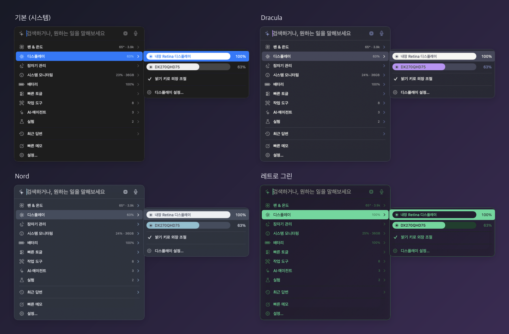

# Divee

**Mac의 자잘한 설정을 메뉴바 하나에서, ⌥Space 한 번으로.**

팬·온도, 밝기, 배터리, 잠자기, 창 정리, 클립보드까지 한곳에 모은 무료 메뉴바 유틸리티입니다. 
메뉴바에는 작은 고양이가 삽니다.

[English](#english) · [사용법](#-사용법) · [기능 자세히](#-기능-자세히) · [AI 도우미](#-ai-도우미) · [테마](#-테마) · [단축키](#%EF%B8%8F-단축키) · [설치](#-설치) · [개인정보](#-개인정보)

 

⌥Space로 열고 ↓ → 만으로 "잠자기 관리 › 유지 시간 › 30분"까지 들어가는 모습

---

## ✨ 이런 앱이에요

- **⌥Space 한 번이면 끝.** 입력창 아래 한 줄짜리 목록에서 항목에 마우스를 올리거나 → 를 누르면, Windows 우클릭 메뉴처럼 **옆으로 펼쳐집니다.** 최대 3단까지 이어집니다.
- **키보드만으로도 다 됩니다.** ↑↓ 이동 · → 펼치기 · ← 접기 · Return 실행 · ESC 닫기. 조절바는 ←/→ 로 움직입니다.
- **원하는 기능만 켭니다.** 24개 모듈 중 필요한 것만 켜고, 꺼 둔 모듈은 아예 돌지 않습니다. 처음에는 시스템 모니터링 · 배터리 · 팬 & 온도 3개만 켜져 있습니다.
- **가볍습니다.** 패널이 닫혀 있을 때 CPU 약 0.6%, 열어 둬도 약 1%. 애니메이션은 macOS 기본 방식만 쓰고, 설정에서 끌 수 있습니다.
- **기본은 이 Mac 안에서만.** AI도 이 Mac 안의 모델을 먼저 씁니다. 밖으로 데이터를 보내는 기능은 켰을 때만 동작하고, 설정에 그대로 표시됩니다.

## 🧭 사용법

### 패널 열기

| 방법 | 동작 |
|---|---|
| **⌥Space** | Divee 패널 열기·닫기 |
| 메뉴바 고양이 **클릭** | 같은 패널을 엽니다 |
| 메뉴바 고양이 **우클릭** | 설정… · 플로팅 패널 고정 · Divee 종료 |

### 첫 화면 구성

입력창 아래에 한 줄씩 나옵니다. 줄 오른쪽 흐린 글자는 지금 값이고, `›`가 있으면 옆으로 펼쳐집니다.

- **시스템 모듈**(팬 & 온도, 디스플레이, 잠자기, 시스템 모니터링, 배터리)은 바로 보입니다.
- **빠른 토글 ›** — 다크 모드 같은 스위치 모음
- **작업 도구 ›**, **AI·에이전트 ›**, **실험 ›** — 켜 둔 모듈들이 분류별로 묶여 있습니다
- **최근 답변 ›** — AI에게 물어본 기록
- **빠른 메모** · **설정…**

### 키보드

| 키 | 동작 |
|---|---|
| ↑ ↓ | 지금 열(column) 안에서 이동 |
| → 또는 Return | 펼치기 (펼침 칸의 첫 항목으로 이동) |
| ← | 한 단계 접기 · 조절바 줄에서는 값 낮추기 |
| → (조절바 줄) | 값 올리기 |
| Return | 실행 · 토글 켜고 끄기 · 선택지 고르기 |
| ESC | 가장 깊은 펼침부터 닫기 → 입력 지우기 → 패널 닫기 |
| ⌘↩ | 검색 결과의 앱·파일을 Finder에서 보기 |

### 검색하기

입력창에 글자를 치면 목록이 검색 결과로 바뀝니다.

| 결과 | 설명 |
|---|---|
| 기능 | 켜 둔 모듈과 모듈 명령(예: "팬 최대로", "밝기 올리기") |
| AI | 문장을 그대로 AI에게 묻기 |
| 앱 · 파일 | Spotlight로 찾은 앱과 파일 |
| 메모 | Apple 메모에서 찾은 메모 |
| 사전 | macOS 사전의 뜻풀이 |
| 계산 | `12*34` 같은 식의 결과 (Return으로 복사) |
| 웹 | 브라우저로 웹 검색 |

## 🧰 기능 자세히

각 모듈은 설정 › **기능**에서 켜고 끕니다. 제목을 누르면 자세한 설명이 펼쳐집니다.

### 시스템

<b>팬 & 온도</b> — CPU·GPU 온도와 팬 속도, 직접 조절까지 <i>(기본 켜짐)</i>

- **패널:** CPU·GPU 온도, 팬마다 조절바(막대 안에 "팬 1", 오른쪽에 RPM). 끌어서 놓으면 그 팬이 수동이 됩니다. **팬 속도 ›** 에서 자동 · 최대 · 온도 연동을 고릅니다.
- **설정:** 메뉴바 온도 표시, 경고 온도와 알림, 갱신 주기, 온도 연동의 최소·최대 온도, 도우미 설치·제거.
- **AI에게:** "팬 상태 어때?", "팬 속도 최대로", "팬 자동으로 돌려놔", "온도 연동 켜 줘"
- 온도·RPM 읽기는 권한 없이 됩니다. **팬 속도를 바꾸려면** 처음 한 번 관리자 암호로 도우미를 설치합니다.

<b>디스플레이</b> — 내장·외장 모니터 밝기

- **패널:** 화면마다 제어 센터식 조절바(막대 안에 모니터 이름). 외장 모니터는 DDC/CI로 조절합니다.
- **밝기 키로 외장 조절:** 키보드 밝기 키(F1/F2)로 외장 모니터도 조절합니다. 손쉬운 사용 권한이 필요합니다.
- **설정:** 클릭한 화면 자동 선택, 밝기 키 연동.
- **AI에게:** "밝기 50으로", "지금 밝기 몇이야?"

<b>배터리</b> — 잔량·건강도·사이클·전력 <i>(기본 켜짐)</i>

- **패널:** 충전 상태와 잔량 막대, 건강도 · 사이클 · 온도 · 전력(들어오는/나가는 W) · 연결된 어댑터.
- **설정:** 완충·부족 알림, 갱신 주기.
- **AI에게:** "배터리 어때?"

<b>잠자기 관리</b> — 잠자기 방지와 덮개 닫아도 켜 두기

- **패널:** ✓ 잠자기 방지, ✓ 닫힘 모드(덮개를 닫아도 계속 켜 둠), **유지 시간 ›** 무기한 · 30분 · 1 · 2 · 4시간.
- **설정:** 시간 지정, "화면도 켜 둠".
- **AI에게:** "30분 동안 잠자기 막아 줘", "덮개 닫아도 안 꺼지게"
- 닫힘 모드는 처음 한 번 관리자 암호가 필요합니다. 켤 때 발열 주의 안내가 나옵니다.

<b>시스템 모니터링</b> — CPU·메모리·네트워크·디스크 <i>(기본 켜짐)</i>

- **패널:** CPU(막대 + 최근 흐름 그래프), 메모리 막대, 네트워크(다운로드 그래프 + 속도), 업타임, 디스크 남은 공간.
- **설정:** 패널·메뉴바에 보일 항목, CPU·메모리 경고 기준, 갱신 주기(1 · 2 · 5초).
- **AI에게:** "맥이 왜 이렇게 느려?"

<b>빠른 토글</b> — 자주 쓰는 스위치 모음

- **켜고 끄기:** 다크 모드 · 마이크 음소거 · 숨김 파일 보기 · 바탕화면 아이콘
- **바로 실행:** 화면 잠금 · 화면 끄기 · 화면 보호기 · 외장 디스크 추출 · 휴지통 비우기(확인 후)
- **AI에게:** "다크 모드 켜 줘", "화면 잠가 줘"
- 다크 모드·휴지통은 자동화(시스템 이벤트·Finder) 권한을 씁니다.

### 작업 도구

<b>클립보드 히스토리</b> — 복사한 것 다시 꺼내기

- 텍스트와 이미지를 최근 20개까지 기록하고, 누르면 다시 복사합니다(이미지는 합계 15MB까지).
- 명령: 기록 비우기
- **AI에게:** "아까 복사한 거 다시 복사해 줘"

<b>메모</b> — 한 줄 빠른 메모 (⌃⌥J)

- **⌃⌥J**를 누르면 한 줄짜리 입력창이 뜨고, 적은 내용이 Apple 메모의 "빠른 메모"에 시각과 함께 들어갑니다.
- **AI에게:** "회의록 메모 찾아 줘", "내일 살 것 메모해 둬"
- 메모 앱을 다루기 위해 자동화 권한을 씁니다.

<b>컬러 픽커</b> — 화면 색 추출 (⌥⌘C)

- 화면 어디든 색을 찍어 HEX 값을 클립보드에 복사합니다. 최근 8개 색이 남습니다.

<b>특수문자</b> — 자주 쓰는 기호를 한 번에

- 기호를 누르면 바로 복사됩니다. 설정에서 목록을 자유롭게 고칠 수 있습니다.

<b>창 정리</b> — 창 모으기·나란히 두기

- **창 그룹:** 자주 같이 쓰는 앱을 묶어 두면(예: 개발 = Code · Xcode · 터미널) 명령 하나로 그 창들을 지금 데스크톱에 모읍니다.
- **AI에게:** "개발 창들 한곳에 모아 줘", "왼쪽 오른쪽으로 나눠 줘", "이 창만 남겨 줘", "숨긴 앱 다 보여 줘"
- 손쉬운 사용 권한이 필요합니다.

<b>스페이스 이름</b> — 데스크톱에 이름 붙이기

- 데스크톱(스페이스)마다 이름을 붙이고, 누르면 그 데스크톱으로 이동합니다. 메뉴바에 지금 데스크톱 이름을 띄울 수 있고, 화면에 떠 있는 스페이스 바도 켤 수 있습니다.
- **AI에게:** "데스크톱 2로 가 줘"

<b>일정 & 미리 알림</b> — 말로 일정 등록

- **AI에게:** "내일 3시에 회의 잡아 줘", "우유 사기 미리 알림", "오늘 일정 뭐 있어?"
- 등록만 할 때는 캘린더 "쓰기" 권한, 기존 일정을 읽을 때는 "전체 접근" 권한을 따로 묻습니다.

<b>날씨</b> · <b>로컬 검색</b>

- **날씨 — AI에게:** "오늘 날씨 어때?" 도시 이름만 open-meteo.com에 보냅니다.
- **로컬 검색 — AI에게:** "지난주 PDF 찾아 줘" 물어볼 때만 Spotlight로 찾고, 따로 색인을 만들지 않습니다.

### AI·에이전트

<b>화면 읽기</b> · <b>웹 검색</b>

- **화면 읽기:** 화면이나 맨 앞 창의 글자를 한 장 찍어 읽고(저장 안 함), "저 버튼 눌러 줘"처럼 화면의 글자를 찾아 누를 수도 있습니다. 화면 기록 · 손쉬운 사용 권한이 필요합니다.
- **웹 검색:** 보이지 않는 창에서 Bing 검색 결과를 읽어 제목 · 주소 · 요약을 가져옵니다.

<b>AI 사용량</b> — Claude Code · Codex 한도 확인

- Claude Code와 Codex의 5시간 · 주간 한도를 얼마나 썼는지 막대로 보여 줍니다. 메뉴바와 경고 색으로도 알려 줍니다.

<b>에이전트 세션</b> · <b>훅(자동화)</b>

- **에이전트 세션:** 열려 있는 Claude Code · Codex 세션 중 승인을 기다리거나 새 답이 온 세션을 알려 주고, 패널에서 바로 답장합니다. ⌥⌘J로 기다리는 세션으로 이동합니다.
- **훅:** 충전기 연결 · 외장 모니터 연결 · 잠자기 · 화면 잠금 · 배터리 완충/부족 · Wi-Fi 연결 등 14가지 상황에 동작(명령 · 단축어 · 앱 실행 · 알림 · 소리 · AI 판단)을 연결합니다.

### 실험

설정 › 기능에서 **실험 기능 보기**를 켜면 나타납니다.

<b>모션 & 노크</b> · <b>수평계</b> · <b>힌지 폴드</b> · <b>카메라 보기</b>

- **모션 & 노크:** 맥북을 톡톡 두드리면(1 · 2 · 3회) 정해 둔 동작을 합니다. 입력 모니터링 권한.
- **수평계:** 맥북 기울기를 수평계로 보여 줍니다.
- **힌지 폴드:** 덮개를 접을 때 화면이 힌지 쪽으로 접히는 시각 효과.
- **카메라 보기:** AI가 요청할 때만 웹캠으로 한 장 보고, 이 Mac 안에서 분석한 뒤 저장하지 않습니다.

> **준비 중** — sillog 업로드와 DevDive 연동은 아직 준비 중이라 켤 수 없습니다.

## 🤖 AI 도우미

입력창에 하고 싶은 일을 문장으로 쓰면, AI가 켜 둔 모듈의 기능을 대신 실행합니다. 모듈마다 할 수 있는 일이 위의 "AI에게" 예시입니다.

| 백엔드 | 어디서 처리 | 설명 |
|---|---|---|
| **로컬 우선** (기본) | 이 Mac | Apple 온디바이스 → Ollama 순으로 쓰고, 안 될 때나 "클라우드로"라고 할 때만 지정한 서버로 넘깁니다. 넘긴 답에는 ☁︎가 붙습니다 |
| Apple 온디바이스 | 이 Mac | Apple Intelligence 모델. macOS 26 이상 |
| Ollama | 이 Mac | 로컬에서 돌리는 Ollama 모델 |
| OpenAI 호환 서버 | 선택한 서버 | OpenAI · OpenRouter · Groq · LM Studio 등. API 키는 키체인에 저장 |

- **음성 입력:** ⌃⌥Space를 누르고 있는 동안 말하면 입력창에 글자로 들어갑니다. 인식은 이 Mac 안에서 합니다.
- **최근 답변:** 패널을 닫아도 요청은 끝까지 진행되고, 결과는 "최근 답변"에서 다시 볼 수 있습니다.

## 🎨 테마

설정 › 일반 › **테마**에서 미리보기를 눌러 바로 바꿉니다. 패널 · 펼침 칸 · 플로팅 패널 · 말풍선에 적용됩니다.

네 테마 한눈에 보기

## ⌨️ 단축키

| 단축키 | 동작 |
|---|---|
| **⌥Space** | Divee 패널 열기 |
| **⌃⌥Space** | 누르는 동안 음성 입력 |
| ⌃⌥J | 빠른 메모 |
| ⌥⌘C | 화면 색 추출 |
| ⌥⌘O | 플로팅 패널 접기·펼치기 |
| ⌥⌘J | 기다리는 에이전트 세션으로 이동 |

모든 단축키는 설정 › 단축키에서 바꿀 수 있습니다.

## ⚙️ 설정

- **기능:** 모듈을 시스템 · 작업 도구 · AI·에이전트 · 실험으로 나눠 보여 줍니다. 켜기 전에도 각 모듈의 설정 페이지를 볼 수 있습니다.
- **일반:** AI 백엔드, 음성 입력, **메뉴바에 표시**(값을 띄울 모듈 최대 2개 — 노치에 가리지 않게), **애니메이션 사용**, 테마.
- **권한:** 어떤 권한이 허용됐는지 한눈에 보고 바로 허용하러 갑니다.
- **정보:** 지금 밖으로 데이터를 보내는 기능 목록, **설정 내보내기·가져오기**(JSON 파일 하나), 첫 실행 안내 다시 보기.

## 📦 설치

1. [**Divee-1.0.0.dmg**](https://github.com/dorkman43/divee/releases/latest/download/Divee-1.0.0.dmg)를 내려받습니다.
2. DMG를 열고 **Divee**를 **응용 프로그램** 폴더로 끌어다 놓습니다.
3. Divee를 실행하면 메뉴바에 고양이 아이콘이 생기고, 처음 한 번 안내가 나옵니다. 쓰려는 기능 묶음(배터리·발열 / 화면·창 정리 / 작업 도구 / AI 도우미)을 고르면 필요한 모듈이 켜집니다.

Apple 공증을 마친 앱이라 "확인되지 않은 개발자" 경고 없이 열립니다.

**요구 사항:** macOS 14 Sonoma 이상, Apple Silicon Mac (M1 이후)

### 권한

켜는 기능에 필요한 권한만, 이유와 함께 물어봅니다.

| 권한 | 쓰는 곳 |
|---|---|
| 손쉬운 사용 | 창 정리, 스페이스 전환, 밝기 키로 외장 조절, 화면 글자 누르기 |
| 화면 기록 | 화면 읽기, 힌지 폴드 |
| 캘린더 · 미리 알림 | 일정 확인·등록 |
| 마이크 · 음성 인식 | 음성 입력 (누르는 동안만) |
| 자동화 | 메모 앱, 다크 모드 전환 · 휴지통 비우기 |
| 입력 모니터링 | 모션 & 노크, 수평계 (실험) |
| 카메라 | 카메라 보기 (실험) |
| 알림 | 배터리 · 팬 경고, 훅 |
| 관리자 암호 (1회) | 팬 속도 조절 · 닫힘 모드용 도우미 설치 |

### 지우기

팬 조절이나 닫힘 모드를 썼다면 설정 › 팬 & 온도에서 **도우미 제거**를 먼저 누르세요. 그다음 Divee를 종료하고 앱을 휴지통으로 옮기면 됩니다.

## 🔒 개인정보

Divee는 기본적으로 **이 Mac 안에서만** 동작합니다. 아래 기능을 켰을 때만 데이터가 밖으로 나가며, 설정 › 정보에 지금 켜진 항목이 그대로 표시됩니다.

| 기능 | 보내는 것 | 받는 곳 |
|---|---|---|
| 날씨 | 도시 이름 | open-meteo.com |
| 웹 검색 | 검색어 | Bing |
| AI 사용량 | 내 사용량 조회 (Codex) | OpenAI 서버 |
| 원격 AI 백엔드를 직접 고른 경우 | 입력한 문장 | 고른 서버 |

화면 읽기와 카메라는 한 장만 보고 저장하지 않습니다. 가속도계 값은 판정 직후 버리고, 키보드 입력은 수집하지 않습니다.

## 💬 피드백

버그나 제안은 [Issues](https://github.com/dorkman43/divee/issues)에 남겨 주세요.

---

## English

**Everything you tweak on your Mac, in one menu bar app — one ⌥Space away.**

Divee is a free, lightweight menu bar utility for Apple Silicon Macs. It gathers fans & temperature, brightness, battery, sleep, window arranging, clipboard history and more into a single **cascading panel** — with a little cat living in your menu bar.

### Highlights

- **Cascading menu.** Press **⌥Space**, hover or press → on a row, and its details slide out to the side (up to three levels). Fully keyboard-driven: ↑↓ move · → open · ← back · Return run · ESC close. Sliders move with ←/→.
- **Search everything.** Type to search modules and commands, apps, files, Apple Notes, the dictionary, math (`12*34`) or the web — or just ask the AI.
- **Lightweight.** ~0.6% CPU when closed, ~1% with the panel open. Native macOS animations only; turn them off in Settings.
- **Private by default.** On-device first. Nothing leaves your Mac unless you enable Weather (open-meteo.com), Web search (Bing), AI Usage, or a remote AI backend — Settings › About lists what is on.

### Modules (turn on only what you need)

| Category | Modules |
|---|---|
| System | **Fan & Temp** (per-fan sliders, Max / Auto / temperature curve) · **Display** (built-in & external brightness via DDC, brightness keys for external displays) · **Battery** (health, cycles, power, adapter) · **Sleep** (keep awake with timer, Clamshell Mode) · **System** (CPU / memory / network / disk with sparklines) · **Quick Toggles** (Dark Mode, mute mic, hidden files, desktop icons, lock / screen off / screen saver, eject, empty Trash) |
| Tools | Clipboard history · Quick notes to Apple Notes (⌃⌥J) · Color picker (⌥⌘C) · Symbols · Window Arrange (gather app groups, split, focus) · Space names · Calendar & Reminders · Weather · Local search |
| AI & agents | Read screen & tap on-screen text · Web search · AI Usage (Claude Code / Codex limits) · Agent sessions (Claude Code / Codex inbox, ⌥⌘J) · Hooks (14 system events → commands, Shortcuts, apps, notifications, AI) |
| Experimental | Motion & Knock · Level · Hinge Fold · Camera look |

### AI assistant

Write what you want in plain language — "set brightness to 50", "max the fans", "gather my dev windows", "what's on my calendar today?" — and Divee runs the matching module actions. Backends: **Local-first** (default: Apple on-device → Ollama, escalates to your chosen server only when needed, marked ☁︎), **Apple on-device** (macOS 26+), **Ollama**, or any **OpenAI-compatible** server (key stored in Keychain). Hold **⌃⌥Space** to talk; speech is recognized on-device.

### Themes

Default (follows your system), Dracula, Nord and Retro Green — Settings › General › Theme.

### Install

Download [Divee-1.0.0.dmg](https://github.com/dorkman43/divee/releases/latest/download/Divee-1.0.0.dmg), drag Divee to Applications and launch it. Notarized by Apple. 
**Requires:** macOS 14 Sonoma or later on Apple Silicon (M1 or later). 
**Shortcuts:** ⌥Space panel · ⌃⌥Space hold to talk · ⌃⌥J quick note · ⌥⌘C pick a color · ⌥⌘O floating panel · ⌥⌘J jump to a waiting session · right-click the menu bar icon for Settings / Quit. 
**Uninstall:** if you used fan control or Clamshell Mode, click **Remove Helper** in Settings › Fan & Temp first, then quit Divee and move it to the Trash.

Feedback and bug reports are welcome in [Issues](https://github.com/dorkman43/divee/issues).

© 2026 dorkman43 · Divee is free to use.

