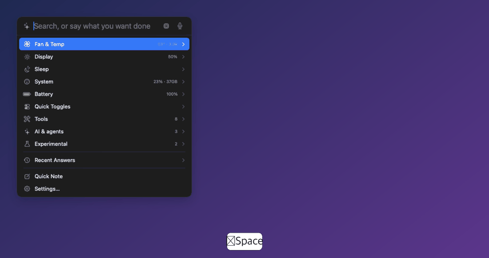
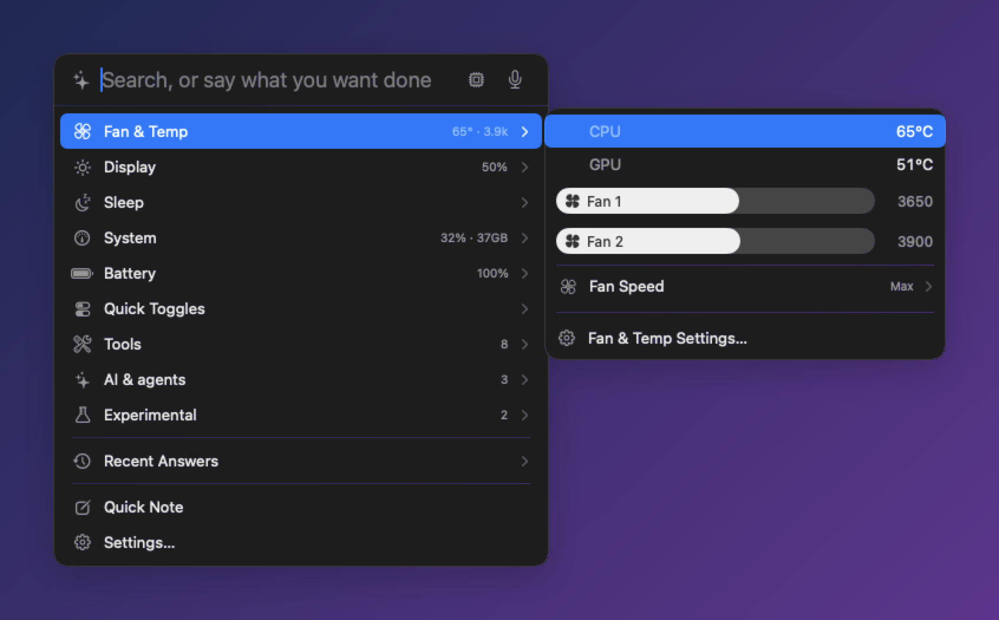
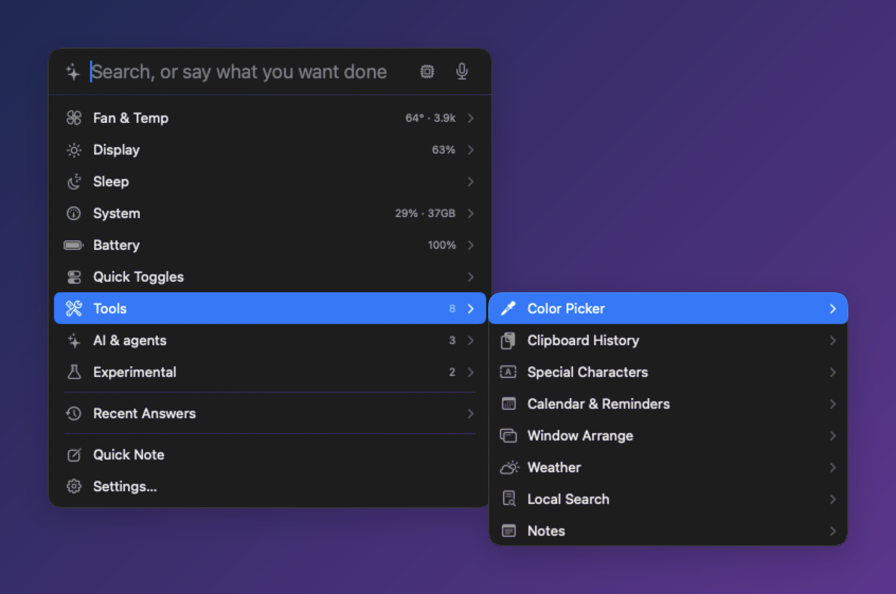
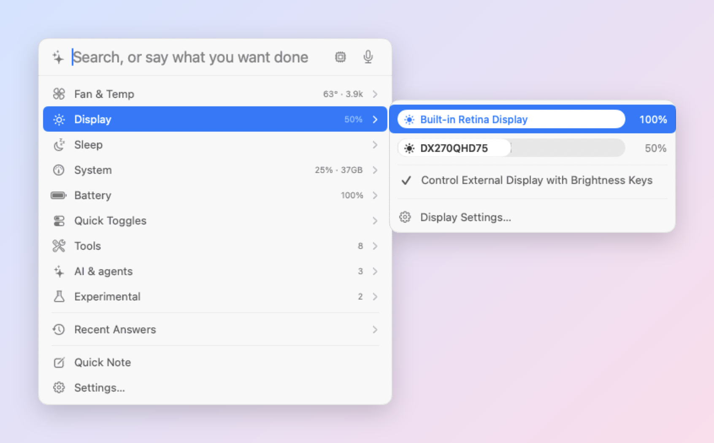
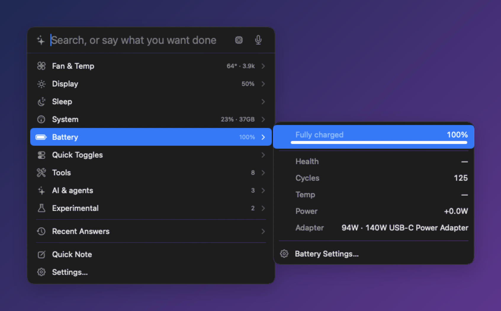
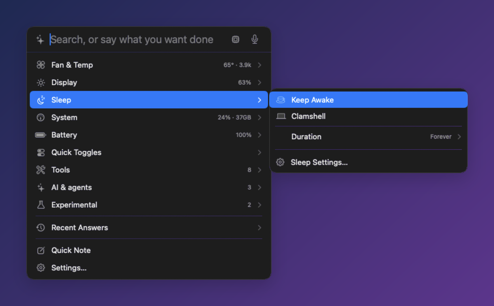
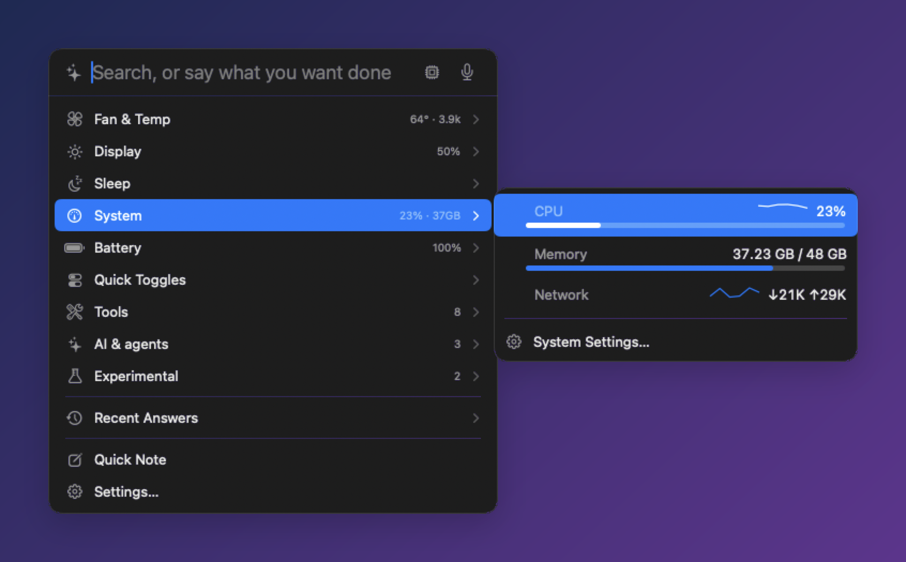
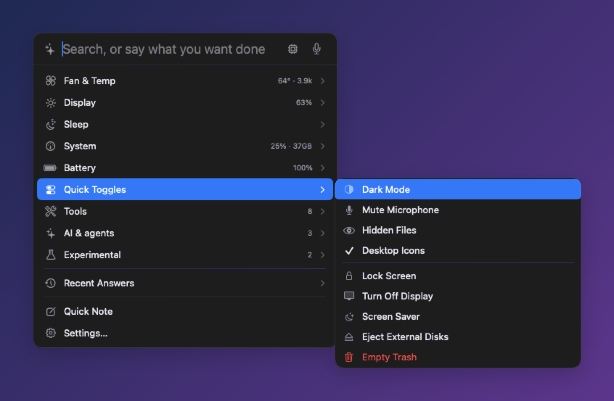
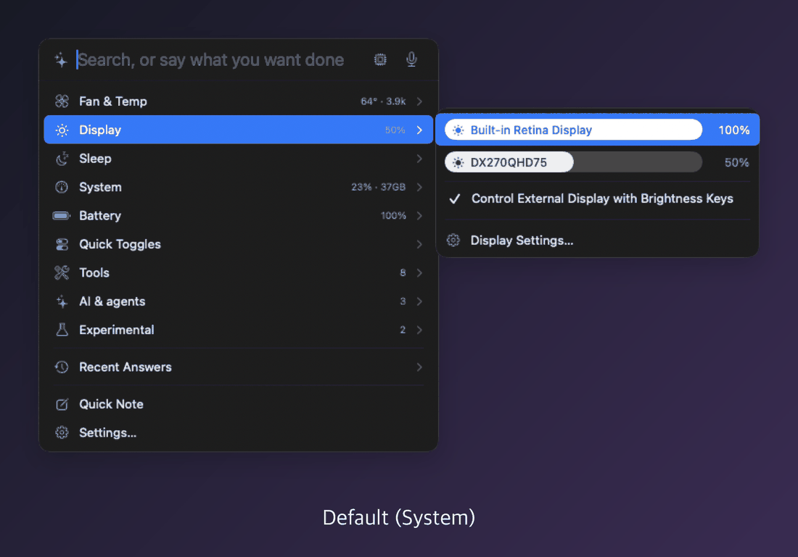
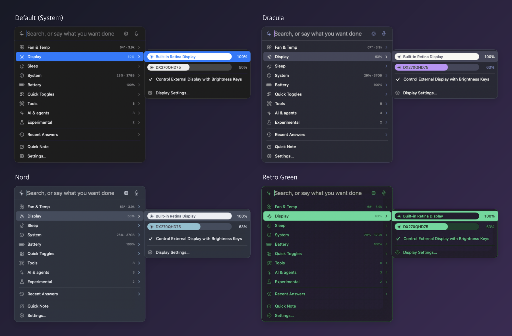

**English** · [한국어](README.ko.md)

# Divee

**All the little Mac settings, in one menu bar app — one ⌥Space away.**

Fans & temperature, brightness, battery, sleep, key remapping, clipboard history and more, in one free menu bar utility. 
A little cat lives in your menu bar.

[Instant cards](#-instant-cards) · [How to use](#-how-to-use) · [Features](#-features-in-detail) · [AI assistant](#-ai-assistant) · [Themes](#-themes) · [Shortcuts](#%EF%B8%8F-shortcuts) · [DevDive](#-devdive-integration-coming-soon) · [Install](#-install) · [Trust](#%EF%B8%8F-built-to-be-trusted)

 

Open with ⌥Space and reach "Sleep › Duration › 30 min" with nothing but ↓ and →

---

## ✨ What it is

- **One ⌥Space and you're there.** Hover a row under the input field or press → and it **slides out to the side**, just like a Windows right-click menu. Up to three levels deep.
- **Fully keyboard-driven.** ↑↓ move · → open · ← back · Return run · ESC close. Sliders move with ←/→.
- **Turn on only what you need.** Pick from 25 modules; modules you turn off don't run at all. Out of the box only System, Battery, Fan & Temp and Checklist are on.
- **Lightweight.** About 0.6% CPU while the panel is closed and about 1% while it's open. Animations are native macOS ones, and you can turn them off in Settings.
- **On your Mac by default.** The AI tries on-device models first. Anything that sends data out works only when you turn it on, and Settings shows exactly what's on.

## ⚡ Instant cards

Type a line and it turns into a card **before you press Return** — computed on your Mac, no AI needed.

| Type | Card |
|---|---|
| `3pm pst in ist`, `what time is it in tokyo` | Time zone conversion (shows next day) |
| `split 2400 between 3`, `18% of 3450`, `72f to c` | Split · percent · unit conversion |
| `days until christmas`, `100 days from now` | Dates and countdowns |
| `weather tokyo` | Weather (with the Weather module on) |
| `what's tomorrow`, `lunch with anna tomorrow` | View and add events — details open right inside the panel |
| `buy milk, eggs and bread` | Checklist → Reminders |
| `timer 25m` | Timer — time left in the menu bar; pause, extend and cancel in the panel |
| `#ff6b35`, `tiffany blue` | Color (copy HEX · RGB · HSL) |
| `what's slow`, `quit slack` | Apps using the most CPU · quit an app |
| `brightness 50`, `fans max`, `keep awake 1h` | Control a feature directly (Return to apply) |
| `claude usage`, `codex limit` | AI usage (Claude Code · Codex limits) |
| `checklist` | Checklist — the input becomes "Add item", checked items get struck through |
| `settings`, `bluetooth settings` | Open the matching System Settings pane |
| `theme nord`, `animations off` | Change Divee by typing (the cat confirms, with undo) |
| `caps lock to esc`, `clear key remap` | Remap a key (Return to apply) |
| `find folders named report`, `pdfs I downloaded last week` | Find files by kind · name · place · date — shows how it understood you |
| `feedback …`, `bug …` | Send feedback — opens a pre-filled GitHub issue; nothing is sent until you submit it |

**Said it as a sentence?** When no rule matches, a tiny on-device classifier (24 KB) picks the card you most likely meant — `make the screen dimmer`, `switch to night mode`, `mute my microphone`. Those cards are marked **✦ On-device**, and if it isn't sure, no card appears.

## 🛡️ Built to be trusted

| | |
|---|---|
| **Notarized by Apple** | Signed with a Developer ID and notarized, so it opens without warnings. |
| **Background helper** | Needed only for fan control and Clamshell. It's registered through macOS's own background items, and you approve it **once** in System Settings › General › Login Items. It does exactly three things: set a fan speed / return it to automatic, toggle `pmset disablesleep`, and uninstall itself. Divee and the helper each check the other's code signature, and if Divee stops responding the helper **returns the fans to automatic and turns Clamshell off within 30 seconds.** When Divee updates, the helper updates itself — no new approval. |
| **Risky actions ask first** | When the AI wants to do something that can't easily be undone — open a file, run a Shortcut, click something on screen, eject disks and the like — the cat shows what it's about to do and waits: **↩ to run, ESC to cancel.** |
| **Signed updates** | Every update and the update feed itself are signed (EdDSA). Divee tells you a new version is out, and nothing installs until you say so. |
| **What it doesn't collect** | No analytics, telemetry or ad tracking. Keystrokes are never recorded; the screen and camera are looked at once, only when you ask, and never saved. |
| **What leaves your Mac** | Only for features you turn on, only to the listed destinations — see the [Privacy](#-privacy) table. |
| **Clean removal** | Settings › Fan & Temp › **Remove Helper** restores your fan and sleep settings and deletes the helper. Then move the app to the Trash — that's it. |

## 🧭 How to use

### Opening the panel

| How | What happens |
|---|---|
| **⌥Space** | Open / close the Divee panel |
| **Click** the menu bar cat | Opens the same panel |
| **Right-click** the menu bar cat | Settings… · Pin floating panel · Send Feedback… · Check for Updates… · Quit Divee |

### The home list

Rows appear one per line under the input field. Dimmed text on the right is the current value; rows with `›` slide out to the side.

- **System modules** (Fan & Temp, Display, Sleep, System, Battery) are right there.
- **Quick Toggles ›** — switches like Dark Mode
- **Tools ›**, **AI & agents ›**, **Experimental ›** — the modules you've turned on, grouped by category
- **Recent Answers ›** — what you've asked the AI
- **Quick Note** · **Settings…**

### Keyboard

| Key | Action |
|---|---|
| ↑ ↓ | Move within the current column |
| → or Return | Open (moves to the first item of the flyout) |
| ← | Close one level · lower the value on a slider row |
| → (slider row) | Raise the value |
| Return | Run · toggle on/off · pick an option |
| ESC | Close the deepest flyout → clear the input → close the panel |
| ⌘↩ | Reveal an app/file search result in Finder |

### Searching

Start typing and the list turns into search results.

| Result | Description |
|---|---|
| Features | Modules you've turned on and their commands (e.g. "max fans", "brightness up") |
| AI | Ask the AI your sentence as-is |
| Apps · Files | Apps and files found with Spotlight. Sentences work too: `find folders named report`, `screenshots on my desktop from today`, `pdfs I downloaded last week` |
| Notes | Notes found in Apple Notes |
| Dictionary | Definitions from the macOS dictionary |
| Math | The result of an expression like `12*34` (Return copies it) |
| Web | Search the web in your browser |

## 🧰 Features in detail

Turn each module on or off in Settings › **Features**. Click a title to expand its details.

### System

<b>Fan & Temp</b> — CPU/GPU temperatures and fan speeds, with manual control <i>(on by default)</i>

- **Panel:** CPU and GPU temperatures and a slider per fan ("Fan 1" inside the bar, RPM on the right). Drag and release to put that fan in manual mode. Choose Auto · Max · Temperature curve under **Fan Speed ›**.
- **Settings:** temperature in the menu bar, warning temperature and alerts, refresh interval, min/max temperatures for the curve, install/remove the helper.
- **Ask the AI:** "How are my fans?", "Max the fans", "Put the fans back on auto", "Turn on the temperature curve"
- Reading temperatures and RPM needs no permission. **Changing fan speed** needs the background helper — approve it once in System Settings › General › Login Items.

<b>Display</b> — built-in and external display brightness

- **Panel:** a Control Center-style slider per display (display name inside the bar). External displays are controlled over DDC/CI.
- **Brightness keys for external displays:** the keyboard brightness keys (F1/F2) adjust external displays too. Requires Accessibility.
- **Settings:** auto-select the display you clicked, brightness-key control.
- **Ask the AI:** "Set brightness to 50", "What's the brightness now?"

<b>Key Remap</b> — turn one key into another (Caps Lock → Esc and more)

- **Presets:** Caps Lock → Esc · Caps Lock → ⌃ Control · Right ⌘ → Caps Lock · Left ⌥ ↔ ⌘ (Windows keyboards), or pick any two keys yourself.
- **Import from Karabiner:** reads the simple key swaps (simple modifications) from `~/.config/karabiner/karabiner.json`. Complex rules are skipped and counted, and the file is never changed.
- **Type it:** `caps lock to esc`, `clear key remap`
- Uses macOS's built-in `hidutil` and re-applies after launch, wake and when a keyboard is connected. Turning the module off (or right-click › **Clear all key remaps**) removes every mapping. Swaps that would lock you out — no Return, no Esc, no ⌘/⌃ — are refused. Keystrokes are never watched or recorded, and no permission is needed.

<b>Battery</b> — charge, health, cycles, power <i>(on by default)</i>

- **Panel:** charging state and level bar, health · cycles · temperature · power (watts in/out) · connected adapter.
- **Settings:** full/low battery alerts, refresh interval.
- **Ask the AI:** "How's my battery?"

<b>Sleep</b> — keep awake, and stay on with the lid closed

- **Panel:** ✓ Keep Awake, ✓ Clamshell (stays on with the lid closed), **Duration ›** indefinitely · 30 min · 1 · 2 · 4 hours.
- **Settings:** custom duration, "keep the display on too".
- **Ask the AI:** "Keep my Mac awake for 30 minutes", "Don't sleep when I close the lid"
- Clamshell uses the same background helper (approve it once in Login Items), shows a heat warning when turned on, and turns itself off when Divee quits or stops responding.

<b>System</b> — CPU, memory, network, disk <i>(on by default)</i>

- **Panel:** CPU (bar + recent history graph), memory bar, network (download graph + speed), uptime, free disk space.
- **Settings:** which items appear in the panel and menu bar, CPU/memory warning thresholds, refresh interval (1 · 2 · 5 s).
- **Ask the AI:** "Why is my Mac so slow?"

<b>Quick Toggles</b> — the switches you use all the time

- **On/off:** Dark Mode · Mute Microphone · Show Hidden Files · Desktop Icons
- **Actions:** Lock Screen · Turn Display Off · Screen Saver · Eject External Disks · Empty Trash (asks first)
- **Ask the AI:** "Turn on dark mode", "Lock my screen"
- Dark Mode and Empty Trash use the Automation permission (System Events, Finder).

### Tools

<b>Clipboard History</b> — get back what you copied

- Keeps up to the last 20 texts and images; click one to copy it again (images up to 15 MB total).
- Command: Clear History
- **Ask the AI:** "Copy what I copied earlier again"

<b>Notes</b> — one-line quick notes (⌃⌥J)

- Press **⌃⌥J** for a one-line input; what you type goes into the "Quick Notes" note in Apple Notes with a timestamp.
- **Ask the AI:** "Find my meeting notes", "Note down what to buy tomorrow"
- Uses the Automation permission to work with Notes.

<b>Color Picker</b> — grab any color on screen (⌥⌘C)

- Pick a color anywhere on screen and copy its HEX value. The last 8 colors are kept.

<b>Special Characters</b> — frequently used symbols, one click away

- Click a symbol to copy it. Includes the Mac key symbols **⌘ ⌥ ⌃ ⇧ ⇪ ⇥ ⏎ ⌫ ⌦ ⎋ ⏏** — plain Unicode, so they paste into messages and docs on other systems too.
- Edit the list freely in Settings (**Restore Defaults** brings back the full list).

<b>Checklist</b> — one simple to-do list in the panel <i>(on by default)</i>

- Type `checklist` and the input becomes "Add item"; click to check, and checked items get struck through. **Clear completed** or **Empty** the list when you're done.
- Saved only on this Mac — no sync.

<b>Window Arrange</b> — gather and tile windows <i>(coming soon)</i>

- Paused while we rework it — it can't be turned on for now. If you had it on, it comes back as it was once it returns.

<b>Space Names</b> — name your desktops

- Give each desktop (Space) a name and click it to switch there. Show the current desktop's name in the menu bar, or turn on a floating Spaces bar.
- **Ask the AI:** "Go to desktop 2"

<b>Calendar & Reminders</b> — add events by saying so

- **Ask the AI:** "Schedule a meeting tomorrow at 3", "Remind me to buy milk", "What's on my calendar today?"
- Asks for write-only calendar access to add events, and full access separately only to read existing ones.

<b>Weather</b> · <b>Local Search</b>

- **Weather — ask the AI:** "What's the weather today?" Only the city name is sent to open-meteo.com.
- **Local Search — ask the AI:** "Find the PDF from last week" Searches Spotlight only when asked; builds no index of its own.

### AI & agents

<b>Read screen</b> · <b>Web Search</b>

- **Read screen:** reads the text of the screen or the front window from a single capture (not saved), and can find and click on-screen text — "click that button". Requires Screen Recording and Accessibility.
- **Web Search:** reads Bing results in an invisible window and returns titles, URLs and snippets.

<b>AI Usage</b> — Claude Code and Codex limits

- Shows how much of the 5-hour and weekly limits of Claude Code and Codex you've used, as bars — also in the menu bar and with warning colors.

<b>Agent Sessions</b> · <b>Hooks (automation)</b>

- **Agent Sessions:** tells you which open Claude Code / Codex sessions are waiting for approval or have a new reply, and lets you reply from the panel. ⌥⌘J jumps to a waiting session.
- **Hooks:** attach actions (command · Shortcut · open app · notification · sound · AI decision) to 14 events such as charger connected, external display connected, sleep, screen lock, battery full/low and Wi-Fi connected.

### Experimental

Appear when you turn on **Show experimental features** in Settings › Features.

<b>Motion & Knock</b> · <b>Level</b> · <b>Hinge Fold</b> · <b>Camera View</b>

- **Motion & Knock:** tap your MacBook (1 · 2 · 3 times) to run an action you choose. Requires Input Monitoring.
- **Level:** shows your MacBook's tilt as a spirit level.
- **Hinge Fold:** a visual effect that folds the screen toward the hinge as you close the lid.
- **Camera View:** takes one webcam look only when the AI asks, analyzes it on your Mac and never saves it.

> **Coming soon** — sillog upload and the [DevDive integration](#-devdive-integration-coming-soon) aren't available yet.

## 🤖 AI assistant

Write what you want done in plain language and the AI runs the matching features of the modules you've turned on. The "Ask the AI" examples above show what each module can do.

| Backend | Runs on | Notes |
|---|---|---|
| **Local-first** (default) | Your Mac | Apple on-device → Ollama; hands off to your chosen server only when needed or when you say "use the cloud". Handed-off answers are marked ☁︎ |
| Apple on-device | Your Mac | Apple Intelligence model. macOS 26 or later |
| Ollama | Your Mac | Ollama models running locally |
| OpenAI-compatible server | The server you choose | OpenAI · OpenRouter · Groq · LM Studio and more. Remote servers need https (http only for servers on this Mac). API key stored in the Keychain, separately per server address |

- **Voice input:** hold ⌃⌥Space and speak; your words go into the input field. Recognition happens on your Mac.
- **Recent Answers:** requests keep running even after you close the panel, and results stay in "Recent Answers".

## 🔗 DevDive integration (coming soon)

<table><tr><td>

**[DevDive](https://devdive.ai)** is *the AI partner that transforms how you work* — a workspace that brings AI tools for images, video and speech together with AI workflows you can share with your teammates to cut down on repetitive work.

</td></tr></table>

Divee will connect to DevDive. Once connected, right from the ⌥Space panel:

- **"Draw a cat"** — generate images
- **"Turn this scene into a video"** — generate video
- **"Read this sentence aloud"** — generate speech
- **"How many DevDive credits do I have left?"** — check credits, and open your workspace in one step

You connect with an API key issued in your DevDive workspace, stored only in your Mac's Keychain. Nothing is sent to DevDive until you turn it on.

## 🎨 Themes

Pick one in Settings › General › **Theme** — it applies instantly. Themes cover the panel, flyouts, floating panel and speech bubble.

All four themes at a glance

## ⌨️ Shortcuts

| Shortcut | Action |
|---|---|
| **⌥Space** | Open the Divee panel |
| **⌃⌥Space** | Hold to talk |
| ⌃⌥J | Quick note |
| ⌥⌘C | Pick a color on screen |
| ⌥⌘O | Collapse / expand the floating panel |
| ⌥⌘J | Jump to a waiting agent session |

Change any shortcut in Settings › Shortcuts.

## ⚙️ Settings

- **Features:** modules grouped into System · Tools · AI & agents · Experimental. You can open a module's settings even before turning it on.
- **General:** AI backend, voice input, **Show in menu bar** (up to 2 modules, so the notch doesn't hide them), **Animations**, Theme.
- **Permissions:** see at a glance what's allowed and jump straight to granting it.
- **About:** what currently sends data out, **export/import settings** (a single JSON file), update checks, **Send feedback…**, replay the welcome guide.

## 📦 Install

1. Download [**Divee.dmg**](https://github.com/dorkman43/divee/releases/latest/download/Divee.dmg).
2. Open the DMG and drag **Divee** into **Applications**.
3. Launch Divee — a cat appears in your menu bar and a short welcome guide shows once. Pick what you want (Battery & Heat / Display & Windows / Tools / AI Assistant) and the matching modules turn on.

It's notarized by Apple, so it opens without the "unidentified developer" warning.

**Updates:** Divee checks once a day (turn it off in Settings › About). When a new version is out, a small dot appears on the menu bar cat and the cat tells you — nothing installs until you click **Install**. If you're on 1.0.0, download the new version from the link above just this once.

**Used fan control or Clamshell before 1.0.5?** The helper now uses macOS's background items. Open Settings › Fan & Temp, click **Move helper to the new method**, then turn Divee on in System Settings › General › Login Items. From 1.0.6 on, the helper updates itself along with Divee.

**Requires:** macOS 14 Sonoma or later on an Apple Silicon Mac (M1 or later)

### Permissions

Divee asks only for what the features you turn on need, and says why.

| Permission | Used by |
|---|---|
| Accessibility | Switching Spaces, brightness keys for external displays, clicking on-screen text |
| Screen Recording | Read screen, Hinge Fold |
| Calendars · Reminders | Checking and adding events |
| Microphone · Speech Recognition | Voice input (only while held) |
| Automation | Notes, Dark Mode toggle · Empty Trash |
| Input Monitoring | Motion & Knock, Level (experimental) |
| Camera | Camera View (experimental) |
| Notifications | Battery and fan alerts, Hooks |
| Login Items approval (once) | The background helper for fan control and Clamshell |

### Uninstall

If you used fan control or Clamshell, click **Remove Helper** in Settings › Fan & Temp first. Then quit Divee and move it to the Trash.

## 🔒 Privacy

Divee works **on your Mac only** by default. Data leaves your Mac only when you turn on one of the features below, and Settings › About lists exactly what's on.

| Feature | What is sent | Where |
|---|---|---|
| Weather | City name | open-meteo.com |
| Web Search | Search query | Bing |
| AI Usage | Your usage lookup (Codex) | OpenAI servers |
| A remote AI backend you chose | Your sentence | The server you chose |
| Update check (once a day, can be off) | App version (request header) | GitHub |
| Send feedback (only when you submit) | What you wrote + Divee version, macOS version, chip | A GitHub issue, in your browser |
| DevDive (coming soon, only when on) | Generation requests (prompts, text) | DevDive servers |

Read screen and the camera look at a single frame and never save it. Accelerometer readings are discarded right after use, and keystrokes are never collected.

## 💬 Feedback

Bug reports and suggestions are welcome. Right-click the menu bar cat › **Send Feedback…**, or type `feedback …` in the ⌥Space panel — it opens a pre-filled [GitHub issue](https://github.com/dorkman43/divee/issues) with your Divee and macOS versions and chip type (nothing else), and you submit it yourself.

© 2026 dorkman43 · Divee is free to use.

